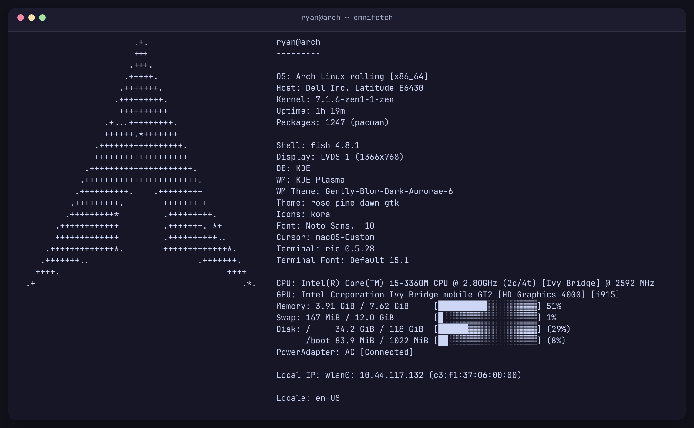
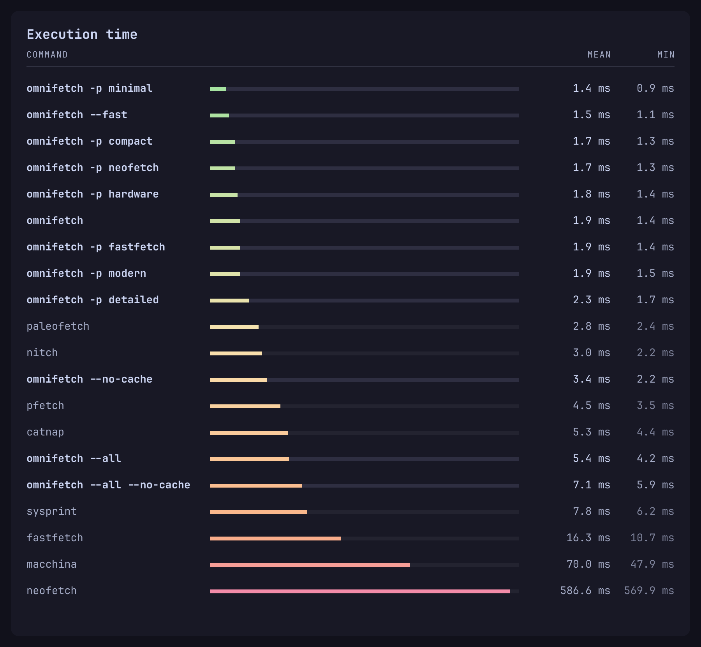

# Omnifetch

[English](README.en.md) · **Русский**

> Быстрый, гибко настраиваемый и визуально приятный системный информатор для Linux, написанный на Rust.

[](LICENSE)
[](https://crates.io/crates/omnifetch-rs)
[](https://www.rust-lang.org/)
[](https://github.com/byindex/omnifetch)
[](https://github.com/byindex/omnifetch)

<p align="center">
  
</p>

---

## Что это

**88 модулей** — от ОС и ядра до мышей, тачпадов, веб-камер, геймпадов, Bluetooth и цитат.
Читает ядро напрямую через `/proc`, `/sys`, DMI, DRM и сокеты (zero `fork`/`exec` для стандартных системных модулей).
Полный список: `omnifetch --list-modules`, описание каждого — в
[docs/FEATURES.ru.md](docs/FEATURES.ru.md).

**Конфиг — главная фишка.** Состав модулей, их порядок, названия, цвета, ширина полосок и
шаблоны вывода задаются в одном файле, `~/.config/omnifetch/config.toml`, собираются
интерактивно через `omnifetch --gen-config` и применяются без перезапуска.
Подробности: [docs/CONFIG.ru.md](docs/CONFIG.ru.md) и
[docs/FUNCTIONS.ru.md](docs/FUNCTIONS.ru.md).

**Кэш в `/dev/shm`** держит то, что не меняется между запусками, и отдаёт за 0.000 мс.
Сбрасывается сам при перезагрузке, установке пакетов или правке конфигурации.
Динамическая периферия опрашивается на лету за ~0.2 мс. Как это устроено —
[docs/DESIGN.ru.md](docs/DESIGN.ru.md).

**2.0 мс** на тёплом кэше, **11-13 мс** на всех модулях без кэша (до 20 мс при холодном вводе-выводе).

**14 пресетов вёрстки**, восемь повторяют вывод конкурентов один в один — так можно
сравнивать скорость на одинаковом наборе данных: [docs/PRESETS.ru.md](docs/PRESETS.ru.md).

**596 ASCII-логотипов** с бинарным поиском, 6 тем, 8 градиентов, Nerd Fonts,
графика Kitty и Sixel, экспорт в SVG/HTML и JSON, тайминги по модулям, автодополнения для
bash, zsh и fish.

## Установка

### Cargo (crates.io)

```bash
cargo install omnifetch-rs
```
*(устанавливает бинарный файл `omnifetch` в систему)*

### Arch Linux (AUR)

Пакеты `omnifetch-bin` и `omnifetch-git` будут опубликованы в AUR сразу после открытия регистрации.

### Сборка из исходников

```bash
git clone https://github.com/byindex/omnifetch
cd omnifetch
make
sudo make install
```

Нужен только `rustc`. Сборка статическая; для динамической — `make build-dynamic`.
Подробности: [docs/INSTALL.ru.md](docs/INSTALL.ru.md).

## Использование

```bash
omnifetch                          # дефолтный вывод
omnifetch --fast                   # только базовые модули
omnifetch --all                    # вообще всё
omnifetch -m host,gpu,devenv       # свои модули
omnifetch -p fastfetch             # как fastfetch
omnifetch --theme nord             # готовая тема
omnifetch --json | jq .            # для скриптов
```

Все флаги: [docs/CLI.ru.md](docs/CLI.ru.md). Пресеты: [docs/PRESETS.ru.md](docs/PRESETS.ru.md).

## Конфигурация

Путь: `$OMNIFETCH_CONFIG`, затем `$XDG_CONFIG_HOME/omnifetch/config.toml`,
затем `~/.config/omnifetch/config.toml`. Флаг `-c` перекрывает всё.

```bash
omnifetch --gen-config              # интерактивный TUI-конфигуратор
```

Описание файла и управление TUI: [docs/CONFIG.ru.md](docs/CONFIG.ru.md).
Переменные и функции шаблонизатора: [docs/FUNCTIONS.ru.md](docs/FUNCTIONS.ru.md).

## Бенчмарки

<p align="center">
  
</p>

- Подробности — [benchmark_results.md](benchmark_results.md)
- Повторить — [benchmark.py](benchmark.py)

## Документация

- [docs/DESIGN.ru.md](docs/DESIGN.ru.md) — почему это быстро
- [docs/FEATURES.ru.md](docs/FEATURES.ru.md) — все возможности
- [docs/INSTALL.ru.md](docs/INSTALL.ru.md) — установка и сборка
- [docs/USAGE.ru.md](docs/USAGE.ru.md) — командная строка на практике
- [docs/CLI.ru.md](docs/CLI.ru.md) — все флаги
- [docs/PRESETS.ru.md](docs/PRESETS.ru.md) — пресеты вёрстки
- [docs/CONFIG.ru.md](docs/CONFIG.ru.md) — файл конфигурации и TUI
- [docs/FUNCTIONS.ru.md](docs/FUNCTIONS.ru.md) — шаблонизатор
- **CLI** — `omnifetch --help`, `--list-modules`, `--list-presets`, `--list-themes`

## Благодарности

ASCII-логотипы взяты и адаптированы из [Fastfetch](https://github.com/fastfetch-cli/fastfetch). Идеи и форматы вывода вдохновлены [Onefetch](https://github.com/o2sh/onefetch), [Cpufetch](https://github.com/Dr-Noob/cpufetch), [Hyfetch](https://github.com/hykilpikonna/hyfetch), [Nitch](https://github.com/ssleert/nitch), [Catnap](https://github.com/iinsertNameHere/catnap), [Macchina](https://github.com/Macchina-CLI/macchina), [Pfetch](https://github.com/dylanaraps/pfetch) и [Neofetch](https://github.com/dylanaraps/neofetch).

Подробности — в [CREDITS.md](CREDITS.md).

## Лицензия

MIT